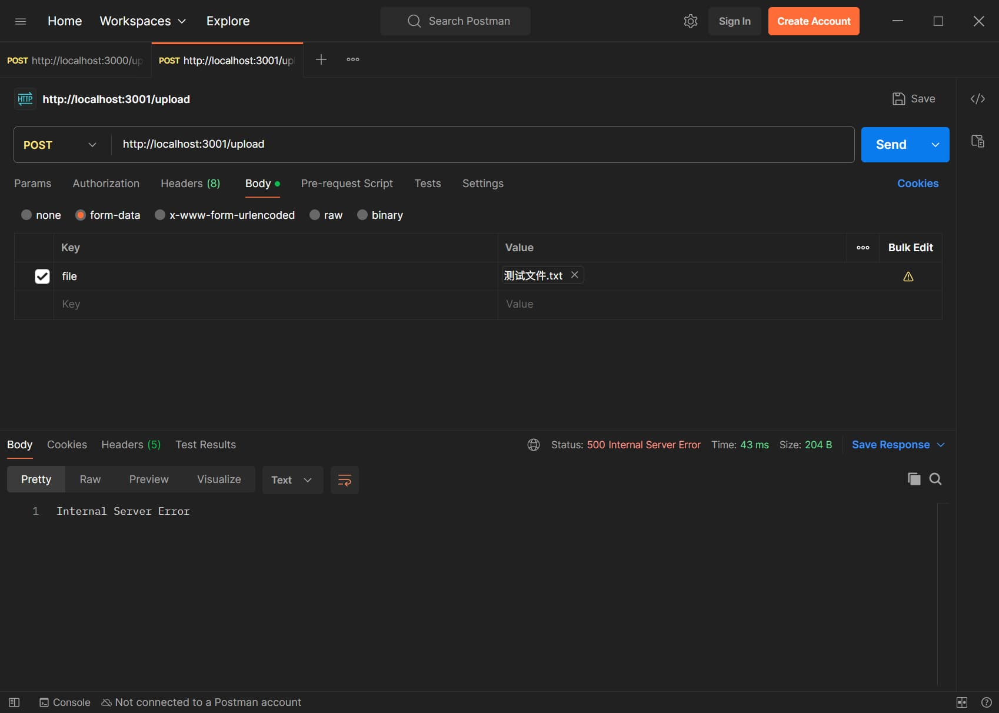

See: https://github.com/honojs/node-server/issues/287

# Error uploading Chinese files to node-server with Postman

In "upload-node", using Postman to upload Chinese files fails.

But in "upload-bun", it can upload successfully.

- OS: Windows 10 LTSC
- Bun Version: 1.3.2
- Node Version: v25.1.0
- Postman Version: 11.70.6

"upload-node" error:

```
TypeError: Failed to parse body as FormData.
    at parsingError (node:internal/deps/undici/undici:6114:14)
    at parseMultipartFormDataHeaders (node:internal/deps/undici/undici:6058:17)
    ... 4 lines matching cause stack trace ...
    at process.processTicksAndRejections (node:internal/process/task_queues:103:5) {
  [cause]: TypeError: expected CRLF
      at parsingError (node:internal/deps/undici/undici:6114:74)
      at parseMultipartFormDataHeaders (node:internal/deps/undici/undici:6058:17)
      at multipartFormDataParser (node:internal/deps/undici/undici:5916:24)
      at node:internal/deps/undici/undici:6364:34
      at successSteps (node:internal/deps/undici/undici:6414:27)
      at readAllBytes (node:internal/deps/undici/undici:5380:13)
      at process.processTicksAndRejections (node:internal/process/task_queues:103:5)
```


